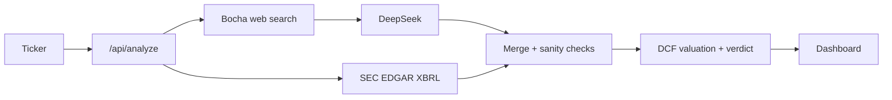
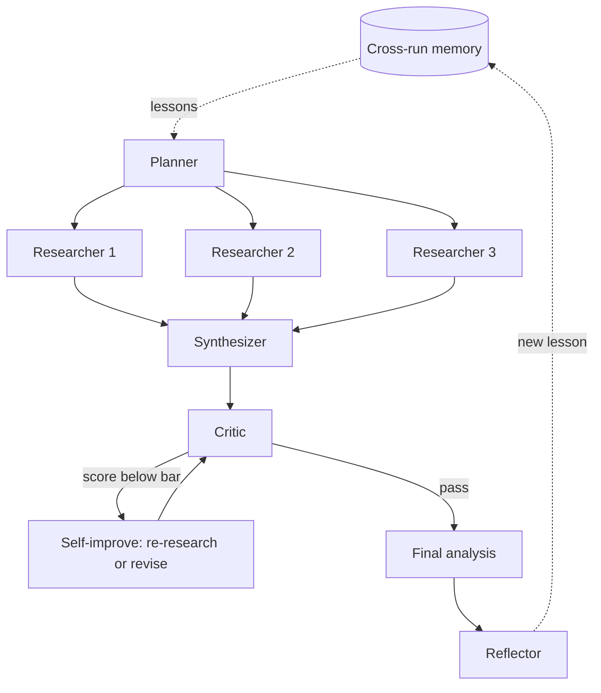

# Internet Business Analysis Copilot

An opinionated analysis tool for internet companies. Instead of a generic AI summary, it reasons through the company's economic engine — users, monetization, KPIs, competition — and ends in an actual valuation call, with facts kept separate from assumptions and clearly flagged when the data is uncertain.

Enter a US-listed ticker (e.g. `PDD`, `UBER`, `NFLX`, `DASH`, `AMZN`) and the app produces a structured, source-backed teardown plus an interactive DCF.

---

## Why it's different

Most AI tools hand you a fluent paragraph. This one is deliberately opinionated:

- **A framework, not a summary.** Every company runs through a causal chain: users → monetization → KPIs → competition → valuation → diagnosis.
- **Facts vs. assumptions, always separated.** Judgment lives in the assumptions column; the reader can see what is known versus inferred.
- **Revenue decomposed into unit economics** — GMV × take rate, paid users × ARPU, active users × time × ad load × CPM — not a single growth number.
- **A reverse-DCF verdict.** Rather than a fake-precise target price, it shows the growth the current market cap *implies*, and whether the model lands cheap / fair / expensive.
- **Honest about its limits.** When a number can't be obtained reliably, it says "insufficient data" instead of fabricating a verdict.

---

## Features

- **Verdict layer** — DCF value per share vs. current price, implied upside/downside, and the **market-implied growth** the price is pricing in.
- **Authoritative financials** — annual revenue read straight from **SEC EDGAR** XBRL filings (works for any US-listed filer, including Chinese ADRs that report a USD figure).
- **Live qualitative analysis** — web search (Bocha) + DeepSeek, with source URLs retained.
- **Interactive DCF** — adjust growth, operating margin, discount rate, and reinvestment rate; the verdict and a sensitivity grid update live.
- **Bilingual** — full English / Simplified Chinese UI and output.
- **Agent deep-analysis mode** — a self-improving multi-agent system that streams its work live (see below).

---

## Architecture



Each input takes its most reliable source: **revenue from SEC** (authoritative), **qualitative analysis from live search**, and the call **compares equity value to market cap** rather than price-per-share (this sidesteps the share-class trap with ADRs). Implausible extracted figures are dropped so the valuation degrades to an honest "insufficient data" rather than a confidently wrong call.

---

## Agent deep-analysis mode

The core dashboard is a deterministic **workflow** — reliable because the steps are predictable. On top of it sits an optional **multi-agent system** for the open-ended part, where the model (not hardcoded code) decides what to research and when it has enough.



- **Orchestration** — a Planner decomposes the task, several tool-using Researchers gather evidence in parallel, a Synthesizer composes the analysis, a Critic scores it against the evidence.
- **Self-improvement (within a run)** — if the Critic scores below the bar, the system re-researches the gap or revises the reasoning, then re-scores.
- **Self-improvement (across runs)** — a Reflector distills a reusable lesson into a small memory file that is loaded into future runs.

The same logic is available as standalone, runnable scripts in [`scripts/`](scripts) (`agent-demo`, `agent-orchestrator`, `agent-self-improving`) and wired into the dashboard as a live streaming panel via `app/api/agent`.

---

## Tech stack

Next.js 15 (App Router) · TypeScript · Tailwind CSS · DeepSeek · Bocha Search · SEC EDGAR · NDJSON streaming.

## Project structure

```
app/                     pages + API routes (/api/analyze, /api/agent stream)
components/              dashboard UI, verdict hero, agent panel
lib/analysis/            prompt, valuation (reverse-DCF), orchestration
lib/finance/sec.ts       SEC EDGAR revenue + company name
lib/search/bocha.ts      web search adapter
lib/agent/               multi-agent orchestrator, tools, cross-run memory
scripts/                 runnable agent demos
```

---

## Local setup

```bash
npm install
cp .env.example .env     # fill in your keys (see below)
npm run dev              # http://localhost:3000
```

### Environment variables

```bash
DEEPSEEK_API_KEY=        # required for live analysis + agent mode
BOCHA_API_KEY=           # required for live web search
FINANCIAL_DATA_PROVIDER=mock   # revenue comes from SEC; market data from search
ENABLE_MOCK_MODE=true    # fall back to demo data if a live call fails
SEARCH_CACHE_TTL_SECONDS=1800
RATE_LIMIT_WINDOW_MS=60000
RATE_LIMIT_MAX_REQUESTS=12
```

Without `DEEPSEEK_API_KEY` / `BOCHA_API_KEY` the app runs in **demo mode** with clearly-labeled illustrative data, so it still boots and is browsable.

---

## Scope and limits

This is a decision-support tool, **not investment advice**. Its job is not to hand you a verdict but to enforce a structured, falsifiable, honest read of a business — and to be explicit wherever the underlying data is uncertain. The valuation is a simplified DCF; non-US-listed companies (pure A-shares / HK-only) fall back to best-effort extraction since they aren't SEC filers.

API keys are server-side only; search results are cached in memory; basic rate limiting protects the API routes. A legacy Flask prototype remains in `app.py` for reference.
